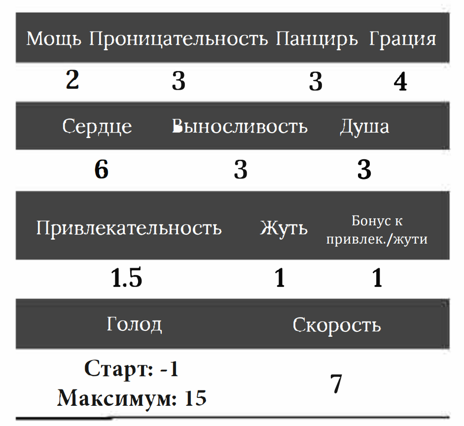
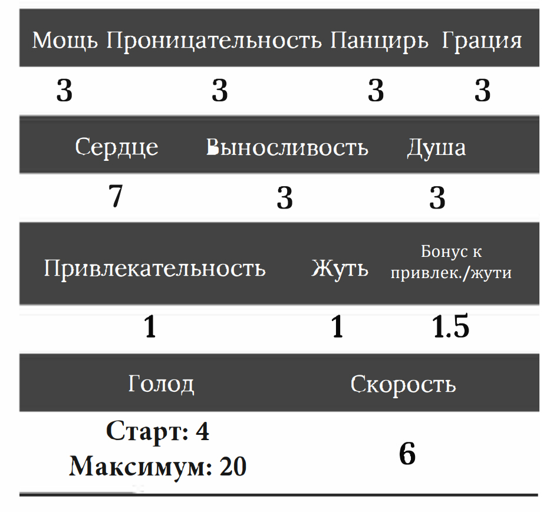
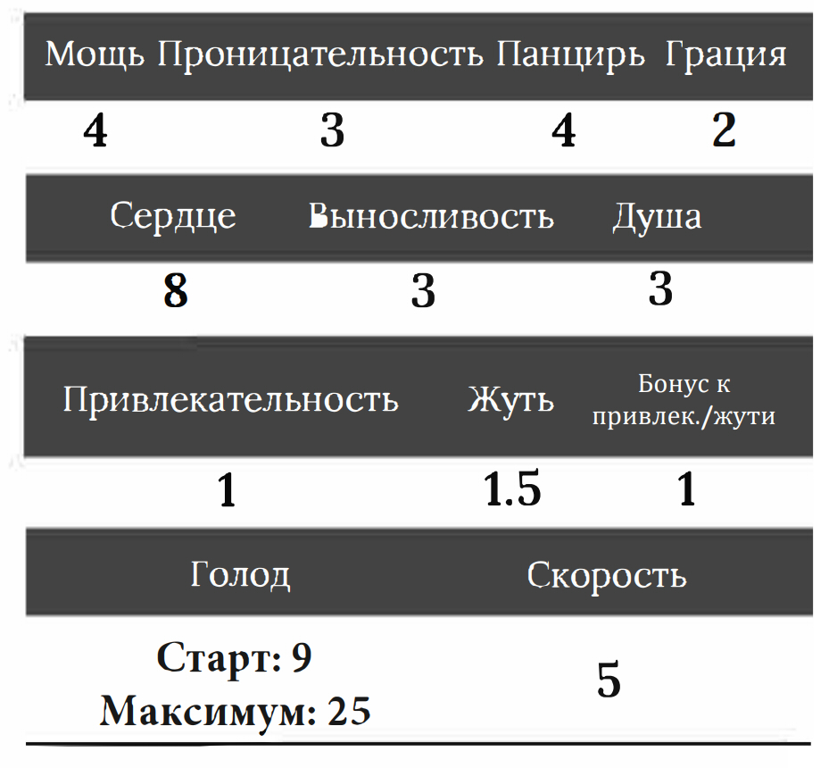

.. _ch2-building-your-bug:
2. Создание жука
==================

Шаблоны
-----------

Мелкий Жук
~~~~~~~~~~~~~

Средний Жук
~~~~~~~~~~~~~

Большой Жук
~~~~~~~~~~~~~

Черты
----------

Чтобы создать жука, игроку необходимо выбрать **Шаблон**, получая все Запасы и Характеристики. После этого, игрок может выбрать **Черты**, которые он желает добавить к своему жуку. У каждой черты есть показатель Голода, который добавляется к Голоду из начального шаблона. Общий показатель Голода не может превышать максимальный из шаблона. Жук игрока может иметь до **семи черт**.

Жук игрока всеядный, имеет две руки, две ноги и от двух до восьми глаз, если **Черта** не изменяет этого.

Черты, выделенные **чёрными точками** — это Подчерты. Нельзя брать Подчерту без указанной **Черты**. Подчерты не занимают лимита семи черт. Черты, выделенные **белыми точками**, — это Подчерты Подчерт, и чтобы взять их, необходимо сперва взять Подчерту с чёрной точкой и основную Черту.

.. include:: traits_natural.rst
.. include:: traits_attribute.rst
.. include:: traits_mental.rst
.. include:: traits_physiological.rst
.. include:: traits_sense.rst
.. include:: traits_mystical.rst
.. include:: traits_body.rst
.. include:: traits_movementl.rst
.. include:: traits_natural-defense.rst
