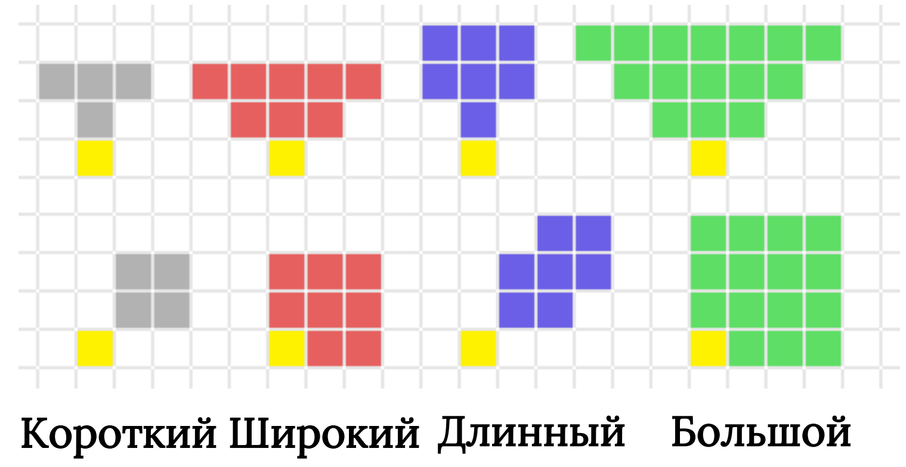

.. _ch10-combat:
10. Сражение
===============

.. _initiative:
Порядок Инициативы
---------------------
Инициатива определяется Грацией. В отличие от большинства проверок в этой системе, Инициатива отслеживается не успешными и проваленными бросками. Вместо этого вы подсчитываете общий результат броска Инициативы вашего жука.

Жук с наивысшим значением Инициативы ходит первым, за ним идут остальные в порядке убывания. Если у жука есть повторный бросок на Инициативу, то он может перебросить кубик, на котором выпало наименьшее значение, и выбрать лучший из двух результатов.

В случае, когда у нескольких жуков одинаковая Инициатива, жук игрока ходит первым, потом союзник, а потом враг.

Клетки и Движение
---------------------
Сражение происходит на клеточной сетке, обычно состоящей из 1-дюймовых клеток. Они называются "клетками" или "квадратами" и являются безразмерной единицей измерения.

Жук может переместиться на количество клеток, равное его Скорости. Движение по диагонали происходит таким же образом.

Клетки
~~~~~~~~
Каждый жук занимает 1 клетку пространства, кроме Больших жуков, которые занимают 4 клетки, объединённые в одну большую. Но при движении они всё равно передвигаются только на 1 клетку в каком-то направлении.

Два жука по обоюдному согласию могут, сжимаясь, делить занимаемые ими клетки. Большие жуки могут принять в одну из своих клеток другого жука Среднего или меньше размера, не сжимаясь.

Жук может переместиться через клетку другого жука, если тот это позволил. Через бессознательных жуков и тела обычно можно свободно перемещаться, но только если они не особенно крупные или не сложены кучей.

Жуки могут попытаться пройти через пространство враждебно настроенного жука, но это провоцирует атаку.

.. _squeezing:
Сжимание
~~~~~~~~~~~
Жук может сжаться, чтобы принять в свою клетку другого жука на один размер меньше. В таком состоянии оба получают штраф -1 на броски атаки и защиты, а также через них не могут пройти другие существа.

Действия
---------------------
Атака
~~~~~~~~~~~
Атака требует траты хотя бы 1 Выносливости. Набор кубиков атаки равен сумме Мощи жука, Качества и Выносливости, которая вложена в рукопашную атаку.

Для дистанционных атак вместо Мощи используется Грация.

.. _aoe:
Площадь эффекта
~~~~~~~~~~~~~~~~~
Площадные эффекты влияют на много клеток. Сделайте бросок атаки и определите результат для каждой цели отдельно. Такую атаку нельзя парировать, можно только уклониться.

На площадные атаки влияют штрафы от укрытия, которые основываются на источнике эффекта — центр огненного шара или кончик Конуса.

.. _cones:
Конусы
~~~~~~~~~~~
Некоторые эффекты могут иметь форму Конуса, а не стандартной дальности.

Для определения того, какие клетки задевает Конус в прямом и диагональном направлениях, используйте следующие шаблоны:

.. _stamina_tax:
Налог Выносливости
~~~~~~~~~~~~~~~~~~~~
Каждая атака повышает стоимость Выносливости на следующую атаку в том же ходу на 1. Эта Выносливость тратится, но она не вложена в бросок атаки.

Налог Выносливости обнуляется в конце хода жука.

.. _attacks_of_opportunity:
.. _aoo:
Провоцированные атаки
~~~~~~~~~~~~~~~~~~~~~~~
Не так легко шагать перед лицом атакующего! Когда ваш жук перемещается через клетки, которые прилегают к другому жуку на количество квадратов, превышающее Манёвренность вашего, то он провоцирует по себе атаку.

Спровоцированный жук может совершить атаку по провоцирующему ценой 1 Выносливости, которая не вкладывается в бросок атаки. Но в него можно вложить больше Выносливости по стандартным правилам.

Один жук может совершить только одну провоцированную атаку по каждому другому жуку в раунд.

Вынужденное перемещение не провоцирует атаки, если не указано иначе.

Отступление
~~~~~~~~~~~~~~~~~~~~
Жук может потратить 1 Выносливость и переместиться на максимум 2 клетки ценой соответствующего количества Скорости, не провоцируя атаку.

После Отступления жук получает 1 единицу :ref:`Дисбаланса <off-balance>`.

.. _grappling:
Захват
~~~~~~~~~~~~~~~~~~~~
Захват — попытка удержать жука, считающаяся атакой. Захват совершается, используя Качество Невооружённого Удара или Качество оружия, которое даёт бонус к захватам. Оно парное, если используемое оружие Лёгкое. Захваты всегда основываются на Мощи.

Броски на захват имеют бонусные кости, число которых равно количеству дополнительных используемых придатков с максимумом в 2. Цель может защититься. Если после действия защиты захват сохраняет хотя бы один успех, цель становится схваченной.

Схваченный жук получает штраф -1 на броски атаки и защиты и не может перемещаться по своей воле. В свой ход он может потратить 1 Выносливость и попытаться вырваться. Для этого можно использовать Мощь или Грацию и вложить больше Выносливости, как в атаку. Схвативший может воспротивиться этой попытке, используя Мощь плюс все бонусы для захвата от эффектов природного оружия и бонус от придатков. При желании он может вложить Выносливость.

Схвативший может совершать со своей жертвой любое количество следующих действий:

* Он может потратить 1 Выносливость, чтобы переместить схваченного на 1 Клетку
* Он может понизить кость любого броска схваченного на 1 ценой 1 Выносливости
* Он может бросить схваченного максимум на 3 клетки ценой 1 Выносливости, как импровизированное оружие, если в клетке прилёта есть жук.

Рывок и Прыжок
~~~~~~~~~~~~~~~~~~~~
Жуки ловкие! Любой жук может потратить 1 Выносливость, что переместиться на 2 клетки в любом направлении. После движения они падают на землю. Движение по земле - Рывок, а движение прямо вверх или по диагонали - Прыжок. 

Находясь в воздухе, жук может потратить Скорость, чтобы удлинить Прыжок максимум на 2 клетки, но прыгать находясь в воздухе нельзя, если только у жука нет способности к полёту.

.. _pogo:
Удар с отскоком
~~~~~~~~~~~~~~~~~~~~
Если жук передвигается над целью и попадает в нее рукопашной атакой — или если цель ее парирует — он может переместиться на 1 клетку вверх, не провоцируя атаки. После удара с отскоком жук может бесплатно переместиться максимум на 2 клетки в любом направлении от клетки, где тот был совершён.

Если удар с отскоком не попал или от него уклонились, то жук приземляется, на выбор, либо в клетку цели, либо же в прилегающую . Также он получает :ref:`off-balance`.

Действия Навыков
~~~~~~~~~~~~~~~~~~~~
В битве жук может ценой 1 Выносливости применить свой Навык: забраться на стену, совершить скачок, который бы не получилось сделать обычным Рывком или Прыжком, попытаться спрятаться от врага — а может и найти прячущегося врага. Это и есть Действие Навыка.

Некоторые пассивные и интуитивные Навыки по типу проверки на Знание, чтобы узнать осведомлённость жука игрока о каком-то типе существ, могут вообще не тратить Выносливость.

.. note::
   
   .. figure:: images/Limn.png
      :width: 150 px
      :alt: Лимн
      :align: right
   
   *Не оставляйте свои Навыки без дела в пылу битвы!*
   
   Использование действий Навыков
   ^^^^^^^^^^^^^^^^^^^^^^^^^^^^^^^^^^^
   Вот некоторые примеры Действий и связанных с ними Навыков, которые могут быть полезны в битве:
   
   | - Остаться незамеченным (Скрытность)
   | - Искать объекты и спрятавшихся противников (Внимательность)
   | - Заговорить зубы врагу (Убеждение)
   | - Отпугнуть врага (Устрашение)
   | - Предугадать действия врага (Тактика)
   | - Передвинуть тяжёлые объекты (Атлетика)
   | - Остаться на плаву в воде (Плавание)
   
   Это не исчерпывающий список всех возможных Действий Навыков, так что вы можете свободно придумать свои.

Малые Действия
~~~~~~~~~~~~~~~~~~~~
Некоторые действия по типу подбора оружия или закрытия двери не тратят Выносливость. Но они тратят Скорость, равную удвоенному весу предмета, который жук желает подобрать или подвинуть, с минимумом в 1.

Отсроченные ходы
~~~~~~~~~~~~~~~~~~~~
Если жук того желает, он может отложить свой ход на потом в цепочке Инициативы. Когда подходит его новый ход, жук не восстанавливает Выносливость, потраченную между отсрочкой хода и его наступлением.

Подготовка
~~~~~~~~~~~~~~~~~~~~
Иногда жуку требуется терпение, но он не может позволить себе отложить ход. В таком случае он может ценой 1 Выносливости подготовить действие. Жуку нужно назвать условие, которое спровоцировало бы его. Это делается в момент подготовки. Когда оговоренное условие происходит, жук незамедлительно вклинивается в ход и совершает подготовленное действие. При этом оно всё ещё тратит Выносливость, которую потребляло бы в обычных условиях.

Защита
---------------------
Защита
~~~~~~~~~~~~~~~~~~~~
Действие защиты совершается в ответ на атаку и потребляет 1 Выносливость. Оно может быть использовано только когда ваш жук становиться целью атаки. Первая единица Выносливости не вложена в атаку, но по желанию ваш жук может вложить больше Выносливости в нее. Каждый успешный бросок защиты вычитает один успешный бросок из атаки.

Есть два типа проверок защиты: парирование и уклонение.

Парирование
~~~~~~~~~~~~~~~~~~~~
Парирование — бросок Мощи, совершаемый щитом или оружием. Этим способом обычно нельзя отразить заклинание или площадную атаку. К броску добавляется Качество используемого щита, а парирование дистанционных атак имеет штраф -1 кость.

Атака считается парированной, когда проверка защиты стирает все успешные броски, полностью нивелируя атаку. Парирование, имеющее хотя бы 1 успех, но не нивелирующее атаку, называется частичным.

При парировании оружием каждая дополнительно вложенная Выносливость даёт 2 кости вместо 1, но ее максимум равен Качеству оружия.

Уклонение
~~~~~~~~~~~~~~~~~~~~
Уклонение — проверка Грации, совершаемая, чтобы избежать атаки. От заклинаний и атак по площади можно уклониться. Когда жук уклоняется, он может переместиться на 1 клетку, не провоцируя атаки, но получая :ref:`off-balance`. При уклонении от атак по площади это необходимо. Жук не может уклоняться, будучи обездвиженным. 

Жук уклоняется от атаки, если проверка защиты убрала все ее успешные броски, полностью нивелируя атаку. Уклонение, имеющее хотя бы 1 успешный бросок, но не избежавшее атаки, называется частичным уклонением.

Вложенная в уклонение Выносливость даёт количество костей, равное весу оружия атакующего.

Глоссарий Выносливости
------------------------

.. _stamina_spent:
Потраченная Выносливость
~~~~~~~~~~~~~~~~~~~~~~~~~
Выносливость, потраченная на действие.

.. _stamina_taxed:
Налог Выносливости
~~~~~~~~~~~~~~~~~~~~~~~~~
Потраченная на действие Выносливость, которая его не усиливает. Представляет усталость.

.. _stamina_dedicated:
Вложенная Выносливость
~~~~~~~~~~~~~~~~~~~~~~~~~
Выносливость, потраченная на совершение или усиление действия. Добавляет к броску к6. Представляет усилия.

Урон и Состояния
---------------------
Вычисление вероятного урона
~~~~~~~~~~~~~~~~~~~~~~~~~~~~~~~~~
Когда у атаки есть хотя бы 1 успешный бросок, она попадает. Подсчитайте все дальнейшие успешные броски и добавьте это число к дополнительному вероятному урону по цели. Общий вероятный урон складывается из базового урона и дополнительного. Максимум последнего равен базовому урону оружия или числу Выносливости, вложенному в атаку, в зависимости от того, что выше.

.. _dmg_reduction:
Понижение урона (ПУ)
~~~~~~~~~~~~~~~~~~~~~~~~~~~~~~~~~
Некоторые вещи по типу брони дают понижение урона. Значение ПУ вычитается из вероятного урона перед попыткой на Впитывание, но не может опустить нанесённый урон ниже 1.

.. _dmg_soaking:
Впитывание урона
~~~~~~~~~~~~~~~~~~~~~~~~~~~~~~~~~
Когда вероятный урон атаки высчитан, защищающийся делает проверку Панциря. Каждый успешный бросок понижает урон на 1.

.. _dmg_magic:
Магический урон
~~~~~~~~~~~~~~~~~~~~~~~~~~~~~~~~~
Магический урон нельзя Впитать, но он все ещё подвержен ПУ и Поглощению, если не указано иначе.

Самый распространенный источник магического урона — заклинания. Все они наносят магический урон, если не указано иначе.

.. _dmg_environmental:
Природный урон
~~~~~~~~~~~~~~~~~~~~~~~~~~~~~~~~~
Как и магический урон, природный нельзя Впитать, но можно понизить и Поглотить. Разница в том, что природный урон свойственен самым разным источникам, по типу смертельной жары и холода, и от него можно защититься разными способами.

Урон по Выносливости и Душе
~~~~~~~~~~~~~~~~~~~~~~~~~~~~~~~~~
Этот урон понижает соответствующий Запас цели на количество единиц, равное нанесённому урону. Он может быть магическим или природным и обычно соответствует типу атаки, которая его наносит. 

.. _dmg_nonlethal:
Несмертельный урон
~~~~~~~~~~~~~~~~~~~~~~~~~~~~~~~~~
Когда жук совершает атаку рукопашным оружием, он может не делать дополнительные броски на урон. Такая атака лишь вырубает цель, если понизила ее Запас Сердца до 0, не убивает и не отправляет к :ref:`Вратам Смерти <death_door>`.

.. _off-balance:
Дисбаланс
~~~~~~~~~~~~~~~~~~~~~~~~~~~~~~~~~
За каждую единицу Дисбаланса жук получает на 1 Выносливость меньше в начале своего хода. Он может потратить определённое количество Выносливости в свой ход, чтобы убрать соответствующий уровень Дисбаланса.

Максимум Дисбаланса равен 3.

После получения жуком Выносливости в начале хода он теряет 1 единицу Дисбаланса.

.. _death_door:
Врата Смерти
~~~~~~~~~~~~~~~~~~~~~~~~~~~~~~~~~
Когда Запас Сердца жука падает до 0, тот оказывается у Врат Смерти и восстанавливает всю Выносливость, если это произошло в первый раз с последнего Отдыха. Получаемый жуком у Врат Смерти урон наносится его Выносливости, которая перестаёт восстанавливаться сама по себе.

Когда Выносливость жука у Врат Смерти падает до 0, тот умирает.

После конца сражения жук у Врат Смерти теряет сознание.

.. _unconsciousness:
Потеря сознания
~~~~~~~~~~~~~~~~~~~~~~~~~~~~~~~~~
Когда Сердце жука падает до 0, он может по желанию потерять сознание, что делает его менее приоритетной целью, но при этом лишает возможности защитить себя. Потеря сознания полностью восстанавливает Выносливость, даже если жук уже был у Врат Смерти с момента последнего Отдыха.

Бессознательный жук не может двигаться или предпринимать какие-либо действия своими силами. Урон по бессознательному жуку наносится Выносливости, которая перестаёт восстанавливаться сама по себе.

Когда Выносливость бессознательного жука падает до 0, тот умирает.

.. _suffocation:
Удушение
~~~~~~~~~~~~~~~~~~~~~~~~~~~~~~~~~
Каждый ход удушения понижает максимум Выносливости жука на 1, а когда та падает до 0, наносит урон Сердцу. Удушение прекращается, когда жук проводит целый ход в пригодном для дыхания окружении.

.. _dot:
Отложенный урон (ОУ)
~~~~~~~~~~~~~~~~~~~~~~~~~~~~~~~~~
Отложенный урон — особый эффект. В начале своего хода жук, если он подвержен ОУ, получает природный урон, равный значению отложенного урона, которое после этого понижается на 1. ОУ сам по себе не считается нанесением урона, но его эффект — да.

ОУ игнорирует понижение урона, если в описании последнего не указано, что оно понижает постепенный урон.

Жук в свой ход может потратить определённое количество Выносливости, чтобы убрать соответствующее значение ОУ.

Отложенный урон может быть определённого типа, например, огонь или кровотечение. Если не указано иначе, эффекты ОУ одного типа не складываются. Вместо этого используйте тот, который имеет большее значение (например, у жука есть 2 огненного отложенного урона и он получает ещё 3. Теперь у него 3 огненного ОУ).

.. _status_effect:
Эффект состояния
~~~~~~~~~~~~~~~~~~~~~~~~~~~~~~~~~
Эффект состояния — это эффект, положительный или негативный, продолжительность которого не зависит от сцены или длительности заклинания.

Эффекты состояния имеют свой Запас и теряют по 1 его единице в конце каждого хода цели, которая также может понизить запас эффекта тратой соответствующего количества Выносливости. Эффект состояния оканчивается, когда его запас опускается до 0.

Если один и тот же эффект состояния накладывается несколько раз, то их запасы суммируются, но эффект не усиливается, если не указано иначе.

Запас эффекта состояния не может иметь больше 10 очков одновременно, если не указано иначе.

.. _deterioration:
Износ
~~~~~~~~~~~~~~~~~~~~~~~~~~~~~~~~~
Иногда оружие получает урон в виде Износа. Износ уничтожает оружие не мгновенно, и некоторое оружие обычный Износ не может уничтожить.

За каждый уровень Износа Качество оружия понижается на 1. Если у оружия есть Модификация, то первый уровень Износа ее убирает.

Если Качество оружия понижено до -1, а единственная его Модификация — Изношенное, то оно уничтожается. Если Модификация другая, оно ломается. При использовании сломанного оружия, оно считается импровизированным.

Износ может быть исправлен, а его эффекты — убраны либо платой кузнецу (цена, обычно это четверть стоимости оружия. Но если оно стоит меньше 100 Гео, то половина), либо действием Починка в лагере.

Износ природного оружия
~~~~~~~~~~~~~~~~~~~~~~~~~~~~~~~~~
Когда природное оружие должно уничтожиться или сломаться, оно вместо этого повреждается и не может быть использовано до Отдыха. 

Природное оружие исцеляет 1 единицу Износа за Отдых, но это число может быть увеличено проверкой навыка Медицины.

Невидимые атаки
~~~~~~~~~~~~~~~~~~~~~~~~~~~~~~~~~
Один жук невидим для другого, если тот не может его обнаружить. Атака или защита против невидимого жука имеет штраф -2. Если жук не знает о невидимом противнике, то он не может уклониться или парировать его первую атаку.

Невидимые жуки не провоцируют атаки.

.. _cover:
Укрытие
~~~~~~~~~~~~~~~~~~~~~~~~~~~~~~~~~
Если жук становится целью атаки, находясь за укрытием, то эта атака имеет штраф -1 кость за каждую четверть тела жука, которая укрыта (это не может уменьшить кости атаки до 0). Если укрыто всё тело, то жук имеет полное укрытие и не может быть атакован напрямую.

Вдобавок, если укрытием от атаки становится повреждаемая цель, и атака полностью промахивается (то есть от нее не уклонились, ее не парировали, а именно промахивается), бросьте кости, которые были убраны из атаки штрафом укрытия. Если бросок успешен, атака попадает по укрытию.

Если укрытие уклоняется, то цель атаки больше его не имеет, а кости входят обратно в изначальный бросок атаки.

.. _rough_terrain:
Пересеченная местность
~~~~~~~~~~~~~~~~~~~~~~~~~~~~~~~~~
Пересеченная местность может быть создана разными эффектами.

Штрафы пересеченной местности расписаны в описании эффекта.

.. _focus:
Фокусировка
---------------------
В бою жук может совершить Действие Фокусировки — короткий промежуток концентрации, на протяжении которого жук направляет энергию в попытке произвести какой-то эффект.

Действие Фокусировки заканчивает ход жука. Эффект Фокусировки всегда вступает в силу в начале следующего хода жука. Если тот потратит Выносливость или Душу до начала следующего хода, то эффекты Фокусировки и все ресурсы, потраченные на нее, исчезают.

.. _focus_soul:
Фокусировка Души
~~~~~~~~~~~~~~~~~~~~~~~~~~~~~~~~~
Жук может Фокусироваться, чтобы исцелить себя. Вложите в Фокусировку какое-то количество Души и бросьте соответствующее количество кубиков. Каждый успешный бросок восстанавливает 1 Сердце. За каждые 3 Души, вложенные в одну Фокусировку, 1 кость считается автоматически успешно брошенной.

Жук имеет число повторных бросков на проверку Фокусировки, равное половине его Проницательности, округлённой в меньшую сторону.

.. _focus_art:
Фокусировка Искусства
~~~~~~~~~~~~~~~~~~~~~~~~~~~~~~~~~
Жук может совершить Фокусировку, чтобы использовать Искусство, которое он не подготовил и в котором давно не упражнялся. Потраченное на концентрацию время позволяет ему использовать Искусство, даже если жук заржавел.

.. _focus_spell:
Фокусировка Заклинания
~~~~~~~~~~~~~~~~~~~~~~~~~~~~~~~~~
Жук может Фокусироваться, чтобы упростить применение заклинания, ослабив нагрузку на свою Душу. При такой Фокусировке цена следующего использованного заклинания снижена на Ранг жука в Пути заклинания.

Фокусировка Заклинания происходит лишь в опасности, поэтому не может быть использована в отсутствии последней. Фокусировки Заклинания не складываются.

.. _focus_stash:
Фокусировка Припасов
~~~~~~~~~~~~~~~~~~~~~~~~~~~~~~~~~
Жук может Фокусироваться, чтобы восстановить Припасы, собирая новые предметы. После срабатывания Фокусировки жук получает Припасы, число которых равно его Рангу в относящихся к Припасам Путях, но с максимумом в 4.

До Отдыха это можно сделать лишь 1 раз.
